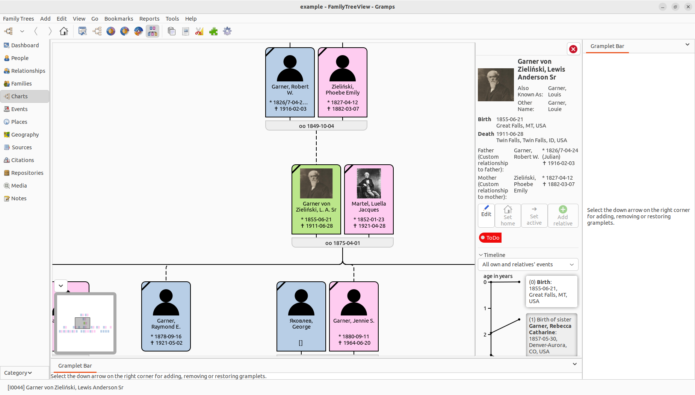

# FamilyTreeView 

FamilyTreeView is a third-party addon for Gramps. It provides a navigable tree representation of ancestors, descendants and other related persons.

Note that this addon is currently under development and should not be considered stable. It has not been thoroughly tested and interfaces are likely to change. **Back up your data before using this addon.**

Features:
- Tree visualization of relatives of the active person
- Info box pop-up with basic information on a person or family (not visible in screenshot below)
- Side panel with detailed information on a person or families including a timeline
- Expanders to show more (or less) ancestors or descendants of corresponding persons or families (not visible in screenshot below)
- Name abbreviation algorithm to fit long names into the fix-sized boxes (`AbbreviatedNameDisplay`)
- Badges for customizable display of interesting / important information (new / custom badges can be [registered](docs/badge_development.md))
- Intuitive zoom centered at mouse pointer position
- Mini map for orientation

Screenshot:

This repository includes the following addons, which are registered individually:
- FamilyTreeView, the main addon of this repository
- FamilyTreeView Example Badges, registers example badges which can be activated in FamilyTreeView's configuration window
- FamilyTreeView Panel Gramplet, can be used to move the integrated panel into the sidebar
  This can be useful if you don't want to hide the sidebar (View -> uncheck Sidebar) because you have other Gramplets open, but you don't want to waste too much of your window/screen width with the panel and the sidebar taking up space.
- Children Quick View, quick view/report listing children, used as a callback example for clicking on badges
- AbbreviatedNameDisplay Inspector Gramplet, lists the abbreviations of the names of the active person (audience=DEVELOPER)

## Installation
FamilyTreeView uses `GooCanvas` to draw the tree. If you are using Gramps' Graph View, this requirement is already satisfied. (In contrast to Graph View, FamilyTreeView doesn't require Graphviz.)
Note that if you have Graph View installed along with FamilyTreeView, the Graph View search bar can be reused and will appear above the FamilyTreeView visualization.

There are two options for adding FamilyTreeView to Gramps. The first lets Gramps know about the provided prebuilds. The second downloads the source code to the right location for Gramps to find. If you have problems with the first option, you can always use the robust alternative of downloading the source code. 

> [!IMPORTANT]
> Back up your data before installing. Do regular backups when working with this addon.

### Making Gramps aware of the pre-builds
1. Open Gramps
2. Click on the puzzle piece icon to open the Addon Manager
3. Go to the "Projects" tab
4. Click the plus at the bottom left
5. Enter `FamilyTreeView` as the project name
6. Enter the following URL: `https://raw.githubusercontent.com/ztlxltl/FamilyTreeView/dist/gramps60`\
   You cannot open this URL with a browser, but you can find the files that Gramps will use here: `https://github.com/ztlxltl/FamilyTreeView/tree/dist/gramps60`
7. Click OK, go to the "Addons" tab and select "All statuses" in the last dropdown menu (usually "Stable" is selected). This is necessary because this addon should not be considered stable.
8. Select "FamilyTreeView" in the second dropdown menu (usually "All projects" is selected). Alternatively, you can search for FamilyTreeView.
9. I recommended to install all three of the addons of this repository (which are explained above). Click the "Install" button of each of the addons.

If you have problems, you can always use the robust alternative of downloading the source code:

### Downloading the source code
1. Find your Gramps user directory. It's usually located here:
    - Linux / MacoOS (built) / other POSIX: `~/.local/share/gramps` (e.g. `/home/<username>/.local/share/gramps`)
    - Windows: `%AppData%\gramps` (e.g. `C:\Users\<username>\AppData\Roaming\gramps`)\
      [Note: According to the Gramps documentation it should be in `C:\Users\<username>\AppData\Local\gramps`, but in my tests it's always in `Roaming`.]
    - MacOS Application Package: `/Users/<username>/.local/share/gramps`
2. Go to the subdirectory `gramps60/plugins`, e.g. `~/.local/share/gramps/gramps60/plugins`.
3. Clone or download the repository to this subdirectory, e.g. `~/.local/share/gramps/gramps60/plugins/FamilyTreeView` or `C:\Users\<username>\AppData\Roaming\gramps\gramps60\plugins\FamilyTreeView`. To do this, click on the green "Code" button on FamilyTreeView's repository on Github and 
    - copy the URL to clone it (I assume you know how to do this if you choose to clone it.)\
      or 
    - click "Download ZIP" to download a ZIP of the source code directly. After the download finished, extract the ZIP file in the subdirectory mentioned above. You can check to make sure that `COPYING.txt` is in the correct location: e.g. `~/.local/share/gramps/gramps60/plugins/FamilyTreeView/COPYING.txt` or `C:\Users\<username>\AppData\Roaming\gramps\gramps60\plugins\FamilyTreeView\COPYING.txt`

## TODOs, ideas & known issues

If you have feedback or bug reports that are not listed below or tracked by a Github issue, you can create a new issue or contact me directly (e.g. via the [Gramps Forum](https://gramps.discourse.group)).

- tree:
  - move siblings closer together if positioning of their descendants allow it
  - more expanders (expand more relatives of a specific person / family)
    - expand parents and siblings of spouse of the active person
    - expand other parents of the active person or an ancestor while the main parent's other families are expanded (but not the children of the other families of the main parents)
    - expand parents/ancestors of other parents
    - maybe more
- more context menus items (add new person as parent, spouse, child etc.)
- implement "add relative" button functionality
- panel:
  - more info (persons and families: media overview; persons: e.g. families, spouses and children)
  - context menu and go to buttons (opt.) next to names in the panel (incl. timeline)
  - context menu on events in timeline (e.g. edit event)
  - badges in info box and panel (separately (de)activatable in config)
  - ticks for negative time (e.g. birth of spouses where marriage is 0)
  - if birth is uncertain, no range
  - option to hide large gaps in timeline (x years removed)
  - better UI design of panel
- adaptive canvas padding based on zoom and ScrolledWindow's size
- more customization options
- height of info box should adjust to content
- add buttons to title bar (e.g. zoom in/out/reset, etc.)
- right-to-left direction (similar to pedigree view) as an alternative to top-to-bottom
- better info for marriage (and likely other events) in timeline
- overlapping lines from families to children appear thicker when zoomed out
- badge priority / not too many badges
- shadow on hover of person and family boxes
- performance test for large trees and possible improvement
- translation
- color coding
- alternative centering of single child
- generalize ui code to support different styles / themes for different visualizations of persons and families
- all the other TODOs in the code

Once the major open items are resolved and the most important TODO features are implemented, this addon may be moved to Gramps' official addon repository and bugs as well as feature requests will be tracked in the Gramps bug tracker.
